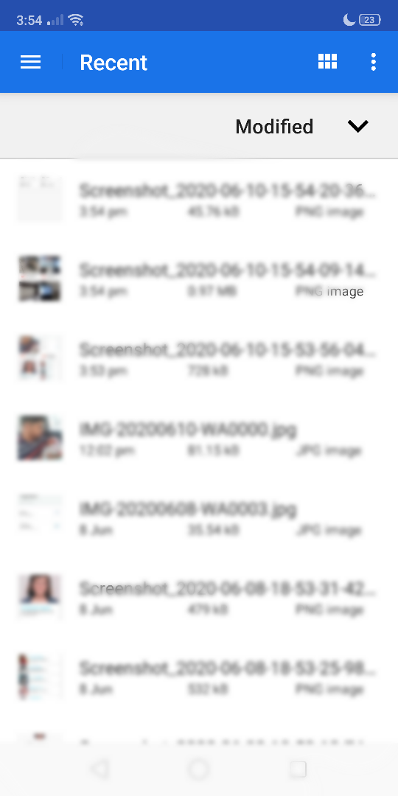
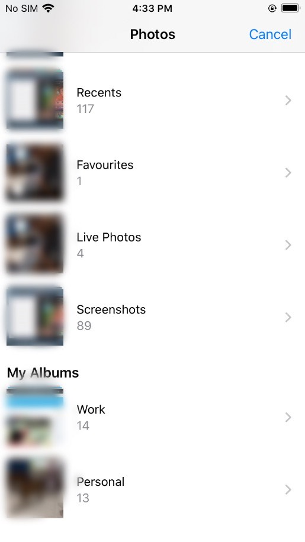
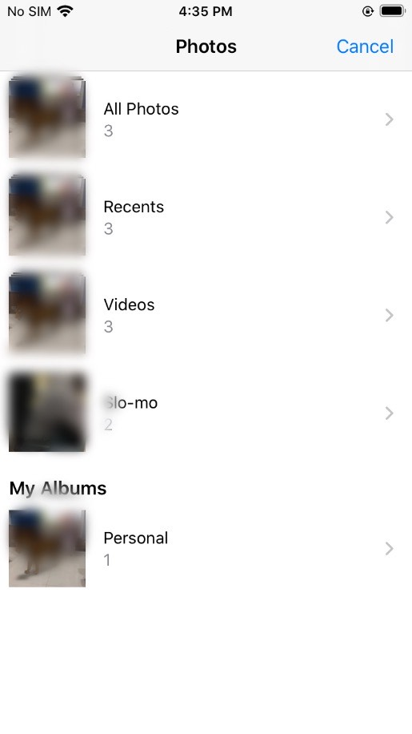
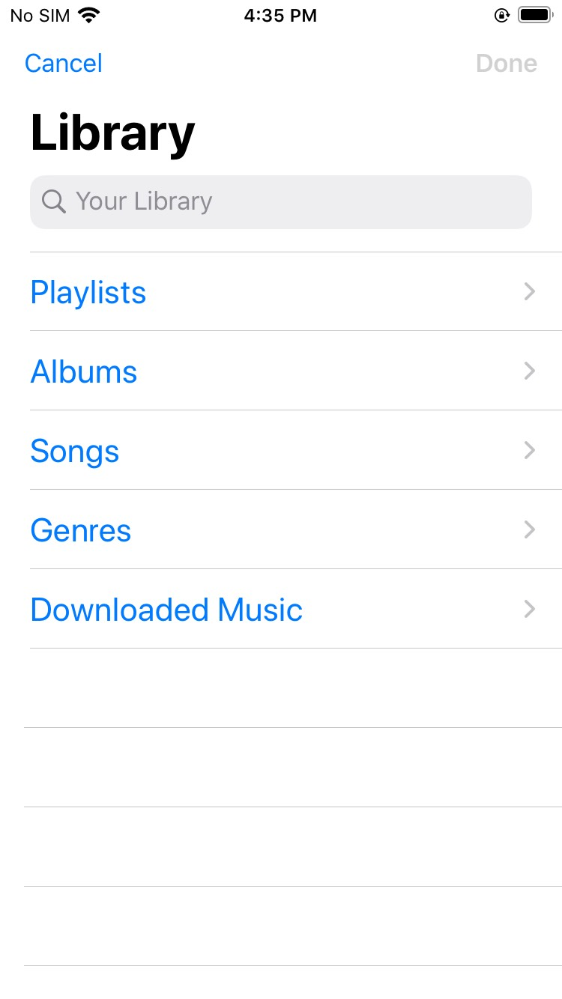
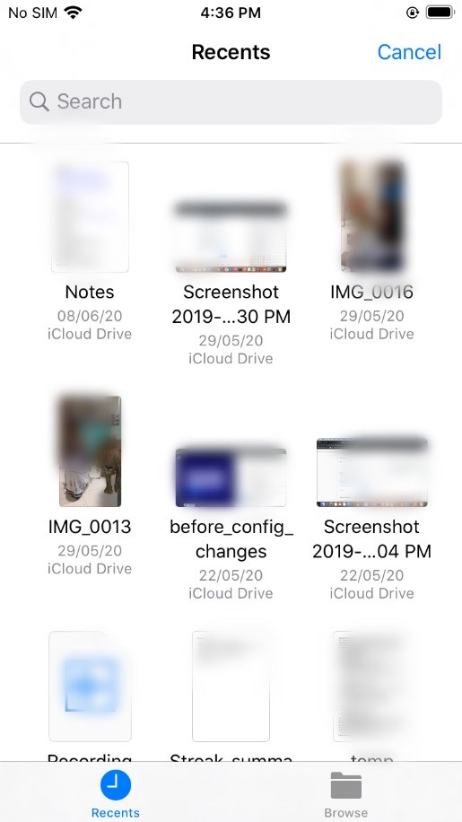

# wm-cordova-plugin-filepicker

Cordova plugin that exposes API to select images, videos, audio and files. This plugin supports both Android and iOS. In iOS, this plugin doesn't support selecting multiple files.

## ANDROID
IMAGE|VIDEO|AUDIO|FILE
-----|-----|-----|----
|||

## IOS
IMAGE|VIDEO|AUDIO|FILE
-----|-----|-----|----
|||

In config.xml, under ios platform add the following. Descriptions can be altered.
```
<preference name="SwiftVersion" value="4.2"/>
```
```
<edit-config target="NSAppleMusicUsageDescription" mode="merge" file="*-Info.plist">
	<string>need music library access to upload audio files</string>
</edit-config>
```
```
<edit-config target="NSPhotoLibraryAddUsageDescription" file="*-Info.plist" mode="merge">
    <string>need photo library access to save pictures there</string>
</edit-config>
```
```
<edit-config target="NSPhotoLibraryUsageDescription" file="*-Info.plist" mode="merge">
    <string>need photo library access to get pictures from there</string>
</edit-config>
```

## API

    cordova.wavemaker.filePicker.selectAudio(
	    true, //to select multiple audio files
	    function(selectedFilePaths) {
	      // code to use the selected audio file paths
	    }, function(error) {
	      // handle error
	    });
    
    cordova.wavemaker.filePicker.selectFiles(
	    true, // to select multiple files
	    function(selectedFilePaths) {
	      // code to use the selected file paths
	    }, function(error) {
	      // handle error
	    });

    cordova.wavemaker.filePicker.selectImage(
	    true, // to select multiple images
	    function(selectedFilePaths) {
	      // code to use the selected image file paths
	    }, function(error) {
	      // handle error
	    });
    
    cordova.wavemaker.filePicker.selectVideo(
	    true, // whether to select multiple Videos
	    function(selectedFilePaths) {
	      // code to use the selected file paths
	    }, function(error) {
	      // handle error
	    });

## License
Apache License - 2.0